# 📊 Monitoreo de Caudales Canal Pirque

Visualización de caudales reportados en las estaciones del Canal Pirque.

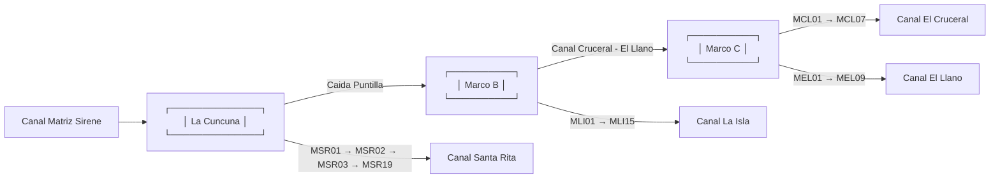

> *Los gráficos se actualizan diariamente.*

---

## Clon MarcoB

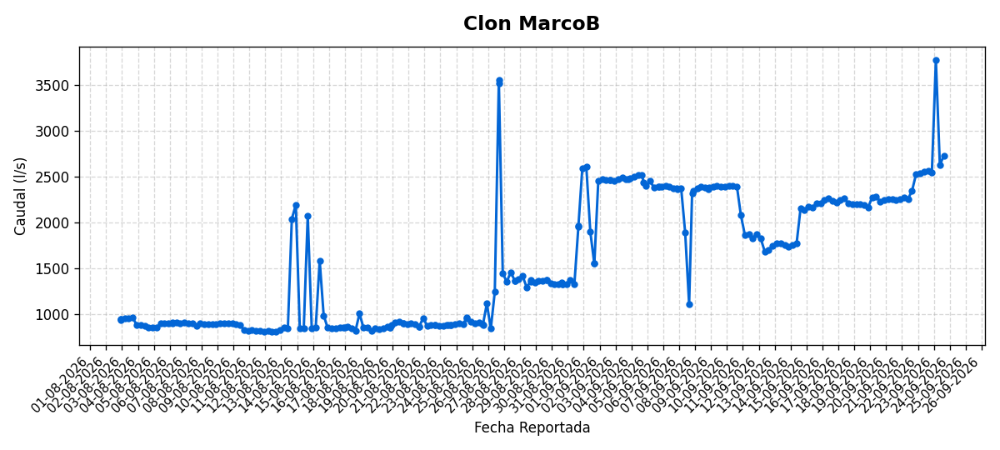

---

## MEL 1

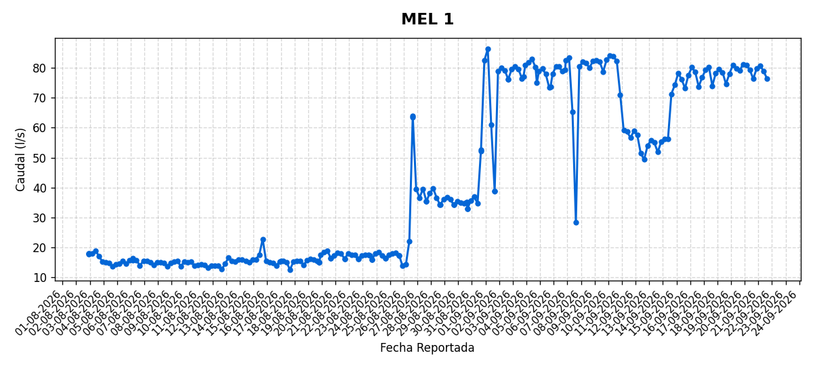

---

## MEL 4

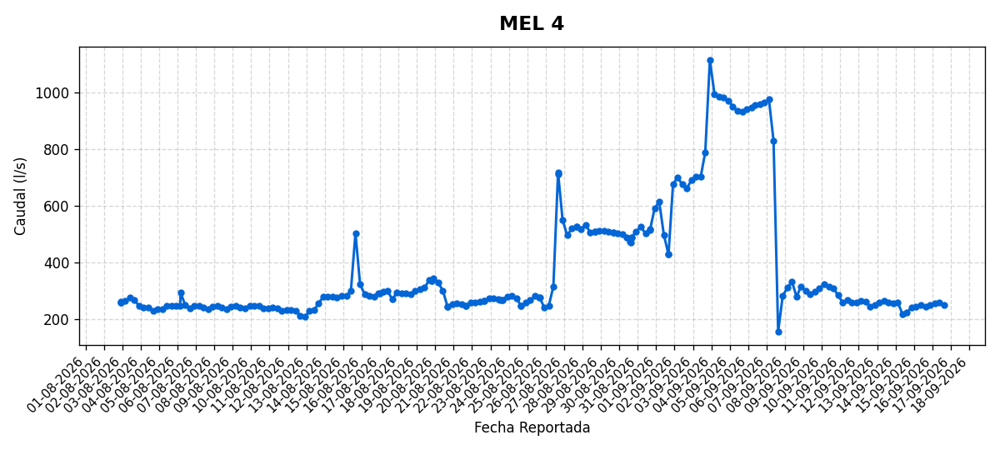

---

## MEL 6

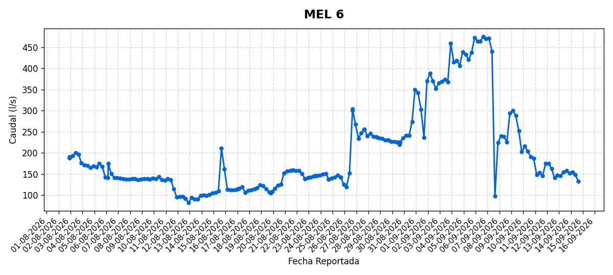

---

## MLI 1

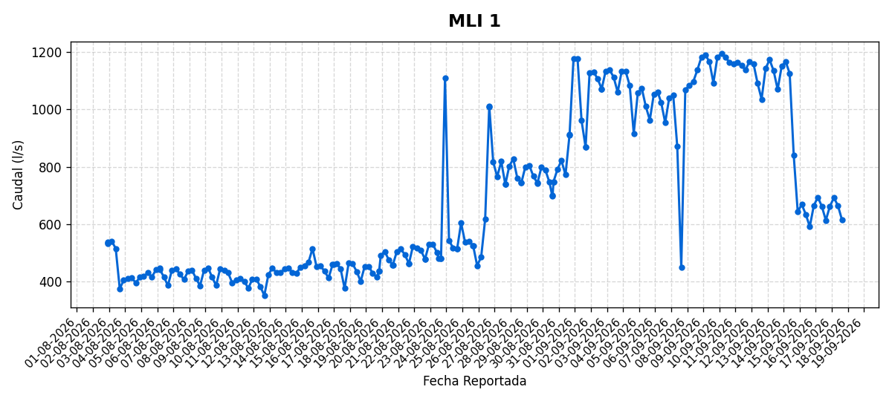

---

## MLI15

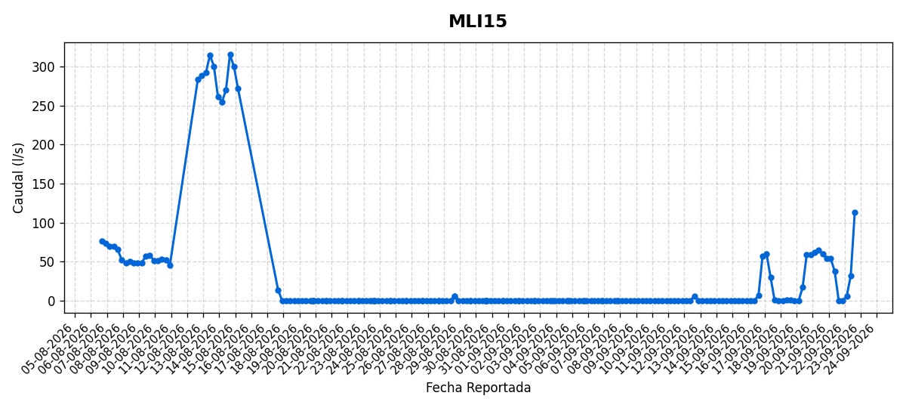

---

## MSR 12

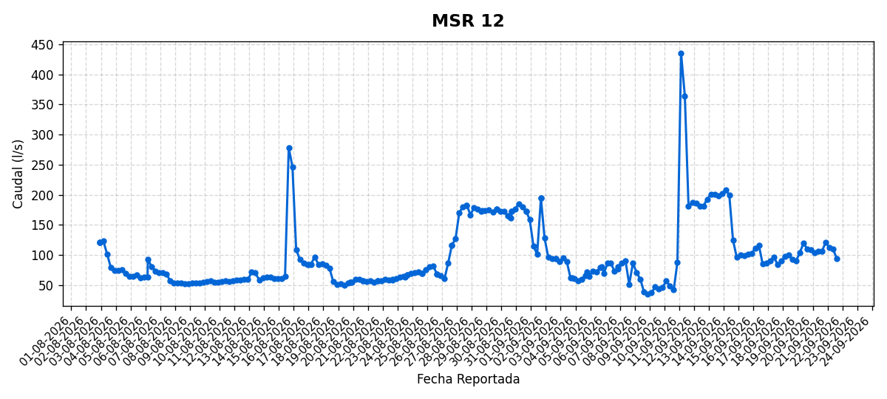

---

## MSR 16

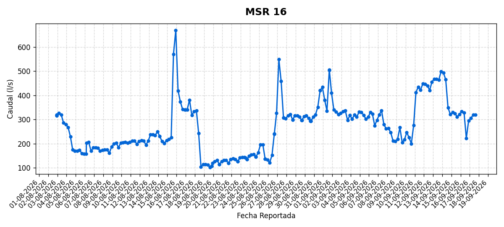

---

## MSR 17

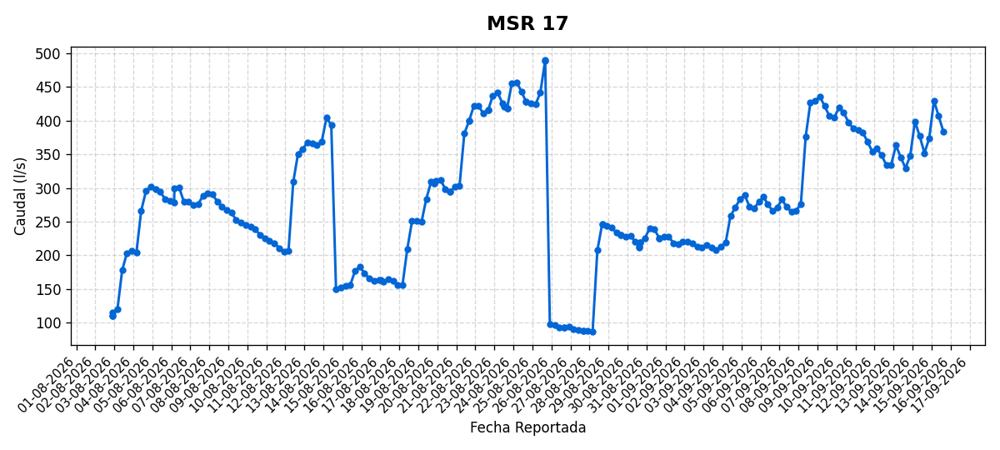

---

## MSR 19

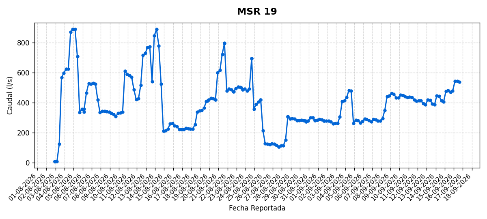

---

## Marco C

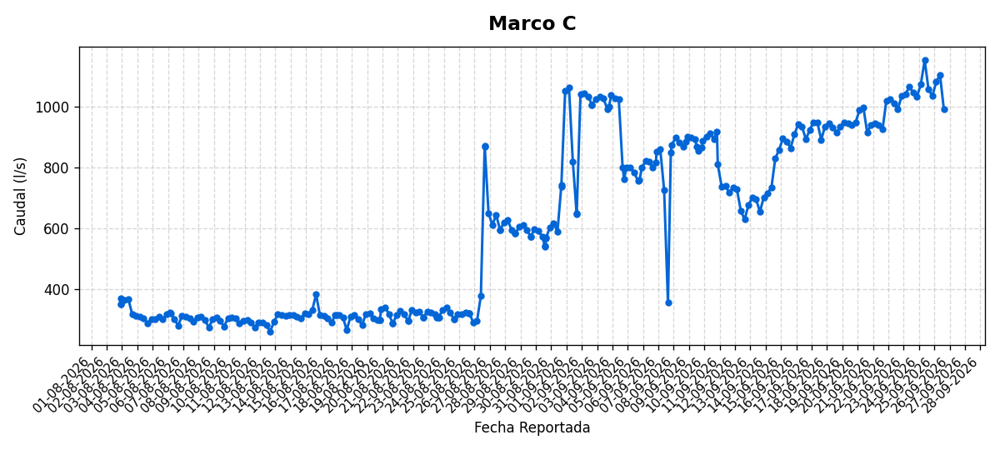

---

## Marco La Cuncuna

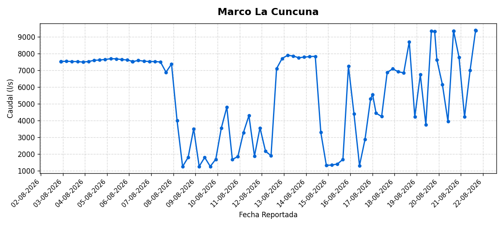

---

## MarcoB

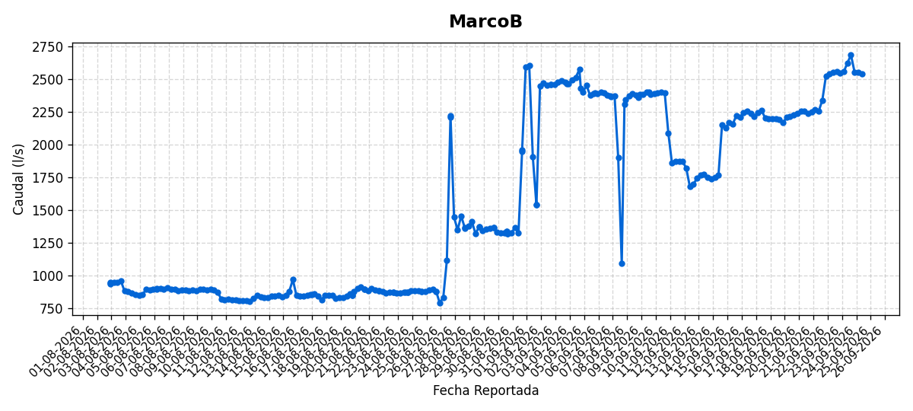

---

